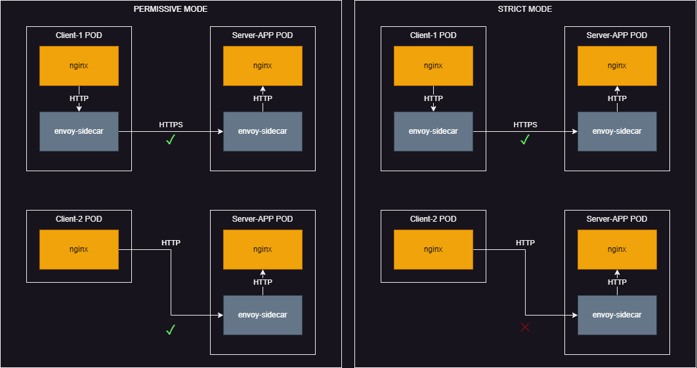

## Demonstrate mTLS between two services on EKS using Istio

For demonstration I've used the `nginx` image 'cause it has simple preconfigured configuration for http server and `curl` out-of-box. Also I've used alias `k = kubectl`

As prerequisites we will need to install Istio on-to k8s cluster.

```
helm repo add istio https://istio-release.storage.googleapis.com/charts
helm repo update
helm install istio-base istio/base -n istio-system --create-namespace
helm install istiod istio/istiod -n istio-system --wait
```

Firstly in the namespace `project-1` I've run two client pods, one without istio-sidecar container and second one with it.
```
k create ns project-1
k run client-1 --image nginx -n project-1
k run client-2 --image nginx -n project-1 --labels sidecar.istio.io/inject="true"
```

Secondly in the `project-2` namespace I've run a pod which will act as a server
```
k create ns project-2
k label namespace project-2 istio-injection=enabled
k create deployment server-app --image nginx -n project-2
k expose deployment -n project-2 server-app --port 80
```

Initially Istio will be precongured in `PERMISSIVE` mode, which means if both participant of connection have sidecars then connection between pods will be secured, even if initiall request was in plain HTTP.

But if we would like to enable mTLS for all traffic for pods in the namespace `project-2` we should enable `PeerAuthentication` with `STRICT` mode

```yaml
k apply -n project-2 -f - <<EOF
apiVersion: security.istio.io/v1beta1
kind: PeerAuthentication
metadata:
  name: default
spec:
  mtls:
    mode: STRICT
EOF
```

Then check connection from both clients, we will see that connection from POD without sidecontainer will be dropped

```
~ ❯ k exec -it client-1 -n project-1 -- bash

root@client-1:/# curl -I http://server-app.project-2
curl: (56) Recv failure: Connection reset by peer
```

```
~ ❯ k exec -it client-2 -n project-1 -- bash

root@client-2:/# curl -I http://server-app.project-2
HTTP/1.1 200 OK
server: envoy
date: Sun, 21 May 2023 14:26:20 GMT
content-type: text/html
content-length: 615
last-modified: Tue, 28 Mar 2023 15:01:54 GMT
etag: "64230162-267"
accept-ranges: bytes
x-envoy-upstream-service-time: 13
```



